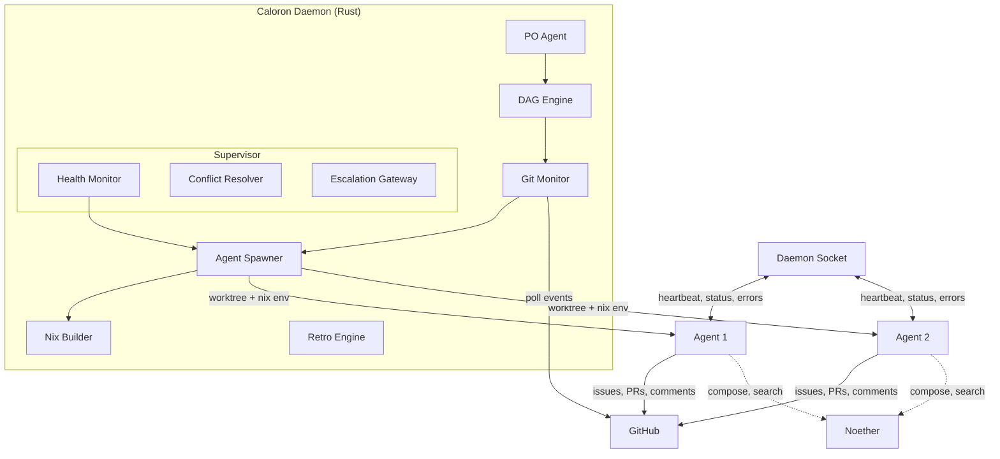

# Architecture

## System Overview



## Component Map

| Component | Location | Responsibility |
|-----------|----------|----------------|
| **CLI** | `src/main.rs` | Command dispatch: kickoff, start, stop, status, retro, agent |
| **Config** | `src/config.rs` | TOML loading, agent definition parsing, model alias resolution |
| **DAG Engine** | `src/dag/engine.rs` | Load/validate DAG, state machine, dependency resolution, persistence |
| **Git Monitor** | `src/git/monitor.rs` | Event handler dispatch — translates Git events to DAG transitions |
| **GitHub Client** | `src/git/client.rs` | Octocrab wrapper: issues, PRs, labels, comments, polling |
| **Agent Spawner** | `src/agent/spawner.rs` | Spawn/destroy agents: worktree + secrets + Nix env + harness |
| **Agent Validator** | `src/agent/definition.rs` | YAML validation with errors and warnings |
| **Worktree Manager** | `src/agent/worktree.rs` | Git worktree create/remove/list/cancel |
| **Nix Builder** | `src/nix/builder.rs` | Write flake.nix, build Nix env, run commands inside Nix |
| **Nix Generator** | `src/nix/generator.rs` | Generate devShell expressions from agent definitions |
| **Health Monitor** | `src/supervisor/health_monitor.rs` | 60-second health check loop, stall detection |
| **Interventions** | `src/supervisor/interventions.rs` | Probe/restart/escalate playbook, intervention tracking |
| **Escalation** | `src/supervisor/escalation.rs` | Structured GitHub issue creation for human escalation |
| **Watchdog** | `src/supervisor/watchdog.rs` | Daemon-level supervisor self-monitoring |
| **Orchestrator** | `src/daemon/orchestrator.rs` | Main loop wiring all components together |
| **Daemon Socket** | `src/daemon/socket.rs` | Unix socket for harness-to-daemon communication |
| **Daemon State** | `src/daemon/state.rs` | Shared async state (config, DAG, agent health) |
| **PO Agent** | `src/kickoff/po_agent.rs` | Repository analysis, DAG extraction, sprint summary |
| **Issue Creator** | `src/kickoff/issue_creator.rs` | Create GitHub issues from DAG tasks |
| **Feedback Collector** | `src/retro/collector.rs` | Parse feedback from comments, build sprint dataset |
| **Analyzer** | `src/retro/analyzer.rs` | Pattern detection: clarity, deps, tools, review loops, efficiency, Noether |
| **Report Generator** | `src/retro/report.rs` | Markdown retro report generation |
| **Noether Client** | `src/noether/client.rs` | CLI wrapper for Noether (search, compose, run, trace) |
| **Harness** | `crates/caloron-harness/` | Thin agent wrapper: secrets loading, heartbeat, feedback enforcement |
| **Types** | `crates/caloron-types/` | All shared data types (DAG, agents, events, config, feedback) |

## Data Flow

### Sprint Execution

```
1. Human runs `caloron start --dag dag.json`
2. DagEngine loads and validates DAG, initializes Ready tasks
3. Orchestrator enters main loop:
   a. GitHubClient.poll_events() → Vec<GitEvent>
   b. For each event: EventHandler.handle(event, dag) → OrchestratorAction
   c. Execute action (spawn agent, merge PR, add label, etc.)
   d. HealthMonitor.check_all(agents) → Vec<HealthCheckResult>
   e. For each unhealthy: InterventionDecider.decide() → InterventionAction
   f. Execute intervention (probe, restart, escalate)
   g. Check dag.is_sprint_complete()
4. Sprint complete → retro
```

### Agent Lifecycle

```
1. DAG task transitions to Ready
2. GitHub issue created with caloron:task label
3. AgentSpawner.spawn():
   a. WorktreeManager.create() → git worktree
   b. inject_secrets() → /run/caloron/secrets/{id}.env
   c. NixBuilder.build_env() → write flake.nix, nix develop --command echo ready
   d. NixBuilder.run_in_env() → nix develop --impure --command caloron-harness start
4. Harness starts:
   a. Load and delete secrets file
   b. Start heartbeat loop (60s)
   c. Run LLM on the assigned task
5. Agent works: read issue → implement → open PR → feedback comment
6. AgentSpawner.destroy():
   a. Kill harness process
   b. Clean up Nix flake directory
   c. Remove git worktree
   d. Delete secrets file
```
