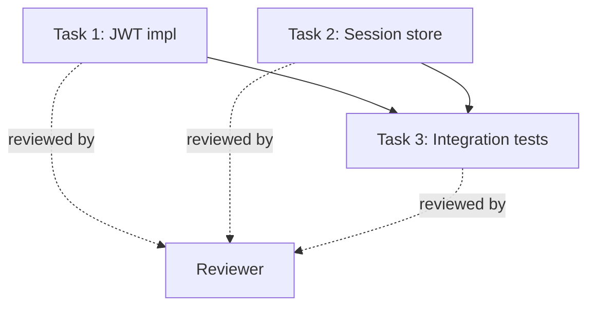

# Core Concepts

## Sprint

A sprint is the unit of work. It has a start (kickoff), an execution phase, and an end (retro). The task DAG is **fixed for the duration of a sprint** — if restructuring is needed, cancel and start a new sprint.

Sprints are designed to be short enough that a fixed DAG is not a limitation.

## Agent

An agent is a combination of:

- A **system prompt** defining its role
- A set of **tools/MCPs** it can use
- An **LLM configuration** (model, temperature, max tokens)
- A **Nix environment** providing its toolchain

Agents are **stateless** — all their state lives in Git. They are created at sprint start and destroyed at sprint end. They are disposable and reproducible.

!!! important
    Agents don't know they are agents in a multi-agent system. They receive tasks as GitHub issues and deliver results as pull requests.

## DAG

The Directed Acyclic Graph defines the sprint structure: which agents exist, what tasks they handle, and how information flows between them.

A DAG edge is a dependency: "Task 3 can only start after Tasks 1 and 2 are both done."

## Git Protocol

Agents communicate exclusively through Git artifacts:

| Artifact | Purpose |
|----------|---------|
| **Issues** | Task assignments and status |
| **Pull Requests** | Work output from an agent |
| **PR Reviews** | Feedback from reviewer to author |
| **Comments** | Messages between agents, feedback reports |
| **Labels** | Machine-readable state signals (`caloron:*` prefix) |

The Git Monitor watches these events and translates them into orchestrator actions. All communication is auditable, versioned, and persistent.

## Supervisor

The Supervisor is a special agent with visibility into all agents' health. It detects and resolves problems:

| Problem | Response |
|---------|----------|
| Agent stalled (no git activity) | Probe comment, then restart, then escalate |
| Credentials failure | Immediate escalation to human |
| Review loop (3+ cycles) | Analyze disagreement, mediate, then escalate |
| Task beyond capability | Escalate with diagnosis |

The Supervisor is itself monitored by a daemon-level watchdog.

## Retro Engine

At sprint end, the Retro Engine analyzes structured feedback posted by agents:

- **Clarity issues** — tasks with low clarity scores
- **Discovered dependencies** — runtime deps not in the DAG
- **Tool gaps** — missing tools agents needed
- **Review loops** — PRs with excessive review cycles
- **Efficiency anomalies** — tasks consuming unusually many tokens

The retro report feeds into the next sprint's planning, making the system improve over time.
