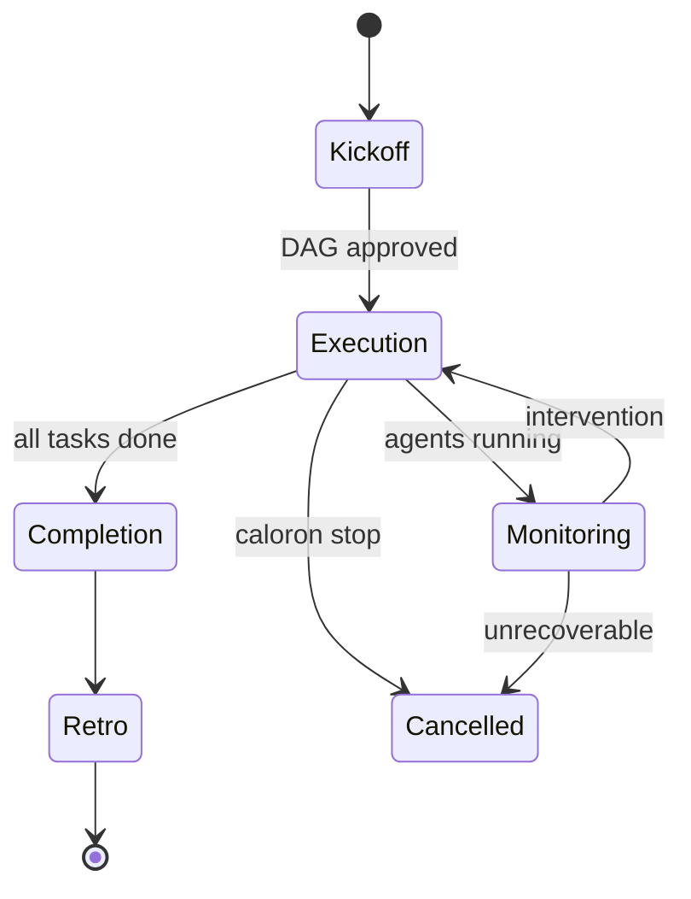
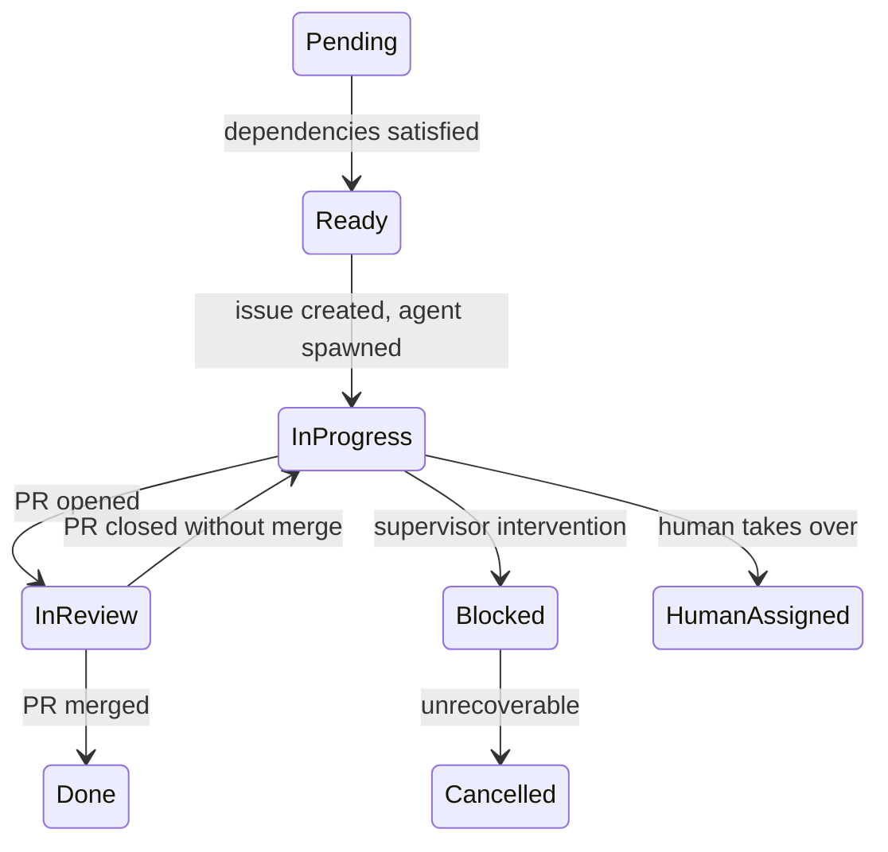

# Sprint Lifecycle

A sprint flows through five phases: kickoff, execution, monitoring, completion, and retro.

## Overview



## 1. Kickoff

```bash
caloron kickoff "implement user authentication"
```

The PO Agent:

1. Analyzes the repository (recent commits, file structure, open issues)
2. Engages in dialogue with the human to refine scope
3. Generates a DAG: tasks, agents, dependencies, review assignments
4. Presents a summary for human approval
5. On approval: writes `dag.json`, creates GitHub issues, sprint begins

## 2. Execution

The daemon loads the DAG and starts the orchestration loop:

1. Tasks with no dependencies transition to **Ready**
2. For each Ready task, the daemon creates a GitHub issue and spawns an agent
3. Agent spawn sequence:
    - Create git worktree (`agent/{id}/sprint-{id}` branch)
    - Inject secrets via temporary file
    - Build Nix environment (cached after first build)
    - Start harness inside Nix: `nix develop --impure --command caloron-harness start`
4. The agent works: reads the issue, implements changes, opens a PR
5. A reviewer agent is assigned to the PR
6. On approval, the orchestrator auto-merges

## 3. Task State Machine



### Completion Chain (PR merged)

When a PR is merged, the orchestrator executes an atomic completion chain:

1. Transition task to **Done** in DAG state
2. Add `caloron:done` label to the linked issue
3. Close the issue with "Completed via PR #N"
4. Evaluate all Pending tasks — unblock those whose dependencies are now satisfied
5. Spawn agents for newly Ready tasks

## 4. Monitoring

The health monitor runs every 60 seconds, checking each agent:

| Check | Threshold | Verdict |
|-------|-----------|---------|
| No heartbeat | 5 minutes | ProcessDead |
| No git activity | Per-agent threshold | Stalled |
| 3+ consecutive errors | Immediate | Stalled (errors) |
| 3+ review cycles on a PR | Immediate | ReviewLoopDetected |

### Intervention Ladder

```
1. Probe    → Post comment asking for status
2. Restart  → Destroy and respawn agent (git state preserved)
3. Reassign → Move task to a different agent
4. Escalate → Create GitHub issue for human
```

Credentials failures skip straight to escalation (the supervisor can't fix tokens).

## 5. Sprint Cancellation

```bash
caloron stop
```

1. All in-progress tasks get a cancellation comment
2. Open PRs are labeled `caloron:sprint-cancelled` but **not closed** (preserves work)
3. All agents are destroyed
4. A partial retro runs on completed tasks
5. State is persisted for audit

## 6. Retro

```bash
caloron retro
```

The Retro Engine collects structured feedback from all task completion comments and produces a report:

```markdown
# Sprint Retro — sprint-2026-04-w2

## Summary
- Tasks completed: 8/10
- Average task clarity: 6.2/10
- Supervisor interventions: 3

## Critical Issues
### Low clarity: task-3 (score: 3/10)
- "Error response format not specified"

## DAG Improvements
- Add dependency: task-3 should depend on Redis setup

## What Worked Well
- task-1 completed successfully (clarity: 9/10, 10000 tokens, 30min)
```
