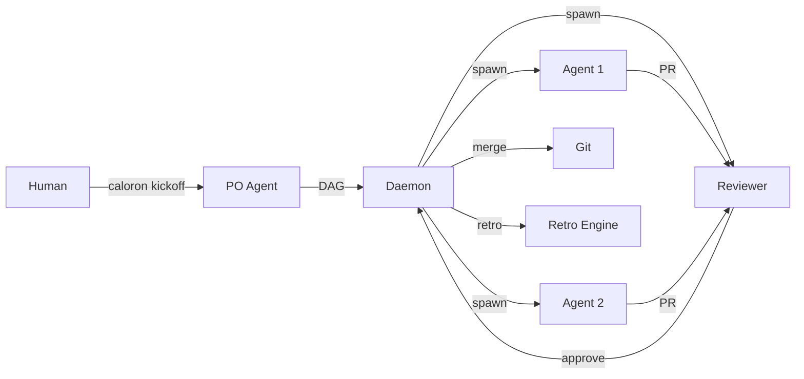

# Caloron

**Multi-Agent Orchestration Platform**

Caloron orchestrates AI agents that collaborate through Git to build software. Agents communicate via issues, pull requests, and code reviews. The orchestrator manages their lifecycle, detects failures, and learns between sprints.

## What Caloron Does

You give Caloron a goal. It:

1. **Plans** — The PO Agent breaks the goal into tasks with dependencies
2. **Executes** — Agents are spawned in isolated Nix environments with dedicated git worktrees
3. **Reviews** — Reviewer agents review PRs, request changes, approve and merge
4. **Monitors** — The Supervisor detects stalled agents, restarts them, escalates to humans
5. **Learns** — The Retro Engine analyzes what went well and what didn't, improving the next sprint



## Key Design Decisions

- **Git is the communication bus** — All agent communication happens through issues, PRs, and comments. No custom protocols.
- **Agents don't know they're agents** — They receive tasks as GitHub issues and deliver results as PRs. The orchestration is invisible.
- **Nix for isolation** — Each agent runs in a reproducible Nix environment. No Docker overhead.
- **Fixed DAG per sprint** — The task graph doesn't change during execution. If restructuring is needed, cancel and restart.
- **Supervisor with playbook** — Stall detection follows a structured ladder: probe, restart, reassign, escalate.

## Quick Start

```bash
# Build
cargo build --workspace

# Validate an agent definition
caloron agent validate examples/agents/backend-developer.yaml

# Build its Nix environment
caloron agent build examples/agents/backend-developer.yaml

# Start a sprint with an existing DAG
caloron start --dag examples/dag.json

# Check status
caloron status

# Run retro after sprint completes
caloron retro
```

See the [Getting Started](guide/getting-started.md) guide for the full walkthrough.

